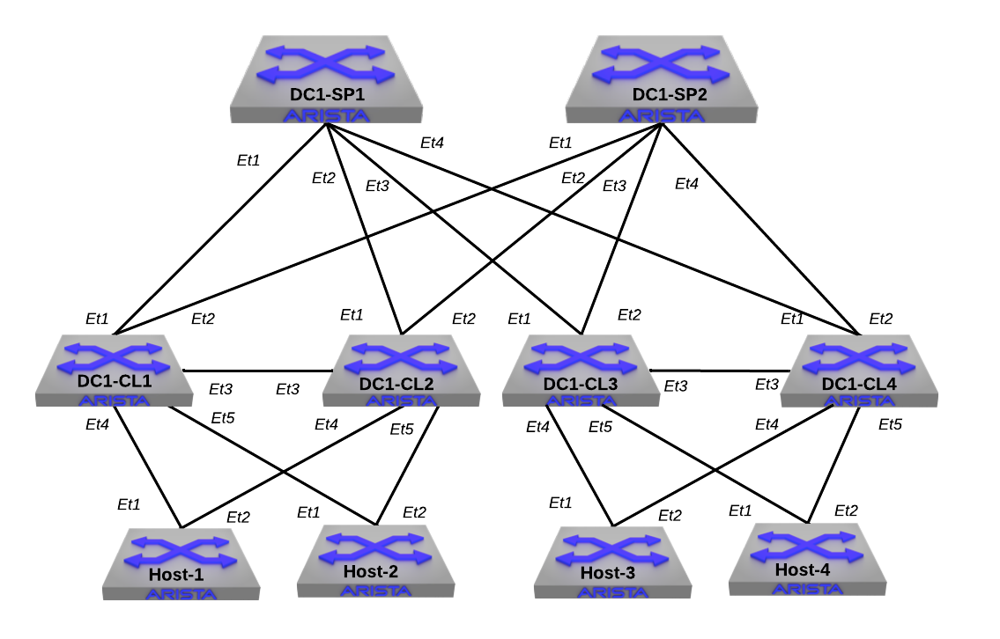

# EVPN symmetric IRB with OSPF underlay
[PS EVPN solution guide](https://docs.google.com/document/d/1VeXddQNdm-k9AtIHWyhL2aB9OZwNuBTpSGbZDjsJpRo/edit#heading=h.r517g2198tuu)
- ALL VTEPs in MLAG.
- Some sensitive information is stored in ansible vault files. Password: arista
- Underlay uses OSPF in single area 0.
- The structure of the YAML files, then notation used and how configuration is generated can be done in multiple ways.
- These examples are just for reference and not ready to be deployed in production, but suggestions to improve them are welcomed.

## Topology

| Host | VRF | VLAN | IP address | GW |
| ------ | ------ |  ------ |  ------ | ------ |
|   host1     |    RED    |  10 |  10.10.10.1 | 10.10.10.254 |
|   host2     |    BLUE    | 20 | 10.10.20.2 | 10.10.20.254 |
|   host3     |    RED    | 30 | 10.10.30.3 | 10.10.30.254 |
|   host4     |    BLUE    | 40 | 10.10.40.4 | 10.10.40.254 |

## Documentation
[Fabric](inventory/documentation/fabric/FABRIC-documentation.md)
[Devices](inventory/documentation/devices)
